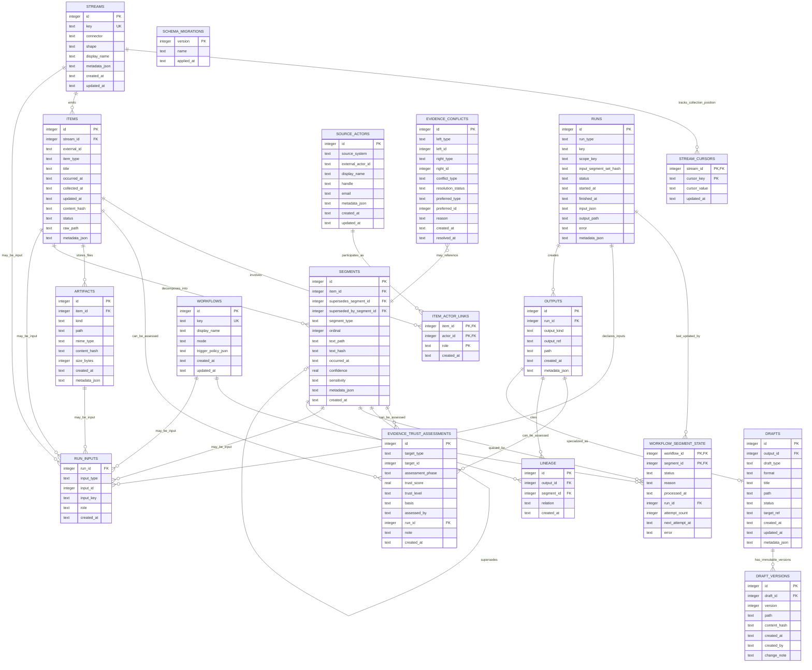

# Continuum 기획서

> 작업명: **Continuum**  
> 한 줄 정의: **모든 맥락을 수집하고, 누락 없이 사용자의 워크플로우에 태우는 개인 맥락 운영체제**

---

## 1. 왜 Continuum인가

Continuum은 사용자의 맥락이 끊기지 않고 흐르는 하나의 연속체라는 의미다.

우리가 원하는 가치는:

> 사용자의 모든 맥락을 계속 수집하고, 각 워크플로우가 빠짐없이 읽고, 처리 결과와 근거까지 추적하는 SSOT.

이 이름이 적합한 이유:

- 끊기지 않는 맥락의 흐름을 표현한다.
- 특정 source나 workflow에 묶이지 않는 추상화 계층을 뜻한다.
- Hermes뿐 아니라 다른 agent, local script, MCP server도 붙을 수 있는 중립적 core를 지향한다.
- 단순 저장소가 아니라 stream, ledger, workflow hub에 가까운 시스템을 나타낸다.

---

## 2. 제품 가치

Continuum의 핵심 가치는 세 가지다.

1. **Capture observable context with provenance**
   - Slack, Plaud, Mail, Calendar, Reminder, 브라우저, 세션, 파일, 직접 입력 등 접근 가능한 source에서 관측 가능한 맥락을 수집한다.
   - 단순히 “많이 모으는 것”이 아니라, 출처/source, 관련 actor, 수집 run, 신뢰도, 민감도까지 함께 남긴다.
   - 수집 실패, 권한 부족, 누락 가능성도 상태로 드러낸다.

2. **Route relevant context without silent drops**
   - 일일 보고, 아침 보고, 일기, todo/calendar 조율, GBrain 저장 등 각 workflow가 필요한 맥락을 가져다 쓸 수 있도록 라우팅한다.
   - “모든 raw text를 모든 workflow가 읽는다”가 아니라, relevant segment가 queue에 들어가고 processed/skipped/failed 중 하나의 명시 상태를 남기는 것이 목표다.
   - 가장 위험한 실패는 에러가 아니라 조용한 누락이므로, unrouted/failed/conflicted 상태를 드러낸다.

3. **Keep context user-owned and agent-neutral**
   - 맥락은 특정 agent의 memory가 아니라 사용자 소유의 중립 core에 남는다.
   - Hermes, Claude Code, Codex, Gemini, local scripts, MCP server, custom agent가 모두 같은 CLI/DB 기반 SSOT에 붙을 수 있다.
   - agent가 바뀌어도 맥락, 처리 상태, lineage, 신뢰도 평가는 유지된다.

---

## 2.5 철학과 검증 원칙

Continuum은 기능보다 먼저 지켜야 할 철학이 있다. 이후 설계/구현 변경은 이 원칙에 위배되지 않는지 계속 검증한다.

### 2.5.1 핵심 철학

1. **Agent-neutral core**
   - Hermes, Claude Code, Codex, Gemini, local script, MCP server 중 어느 하나에도 종속되지 않는다.
   - core는 SQLite + filesystem + CLI 중심으로 유지한다.
   - agent는 consumer/producer 중 하나일 뿐, 시스템의 전제 조건이 아니다.

2. **Deterministic-first**
   - cron, cursor, dedupe, sync, hash, routing, 상태 업데이트처럼 결정론적으로 처리 가능한 일은 deterministic worker가 담당한다.
   - LLM/agent는 의미 판단, 요약, 초안 작성처럼 비결정론적 판단이 필요한 곳에만 쓴다.
   - 과하게 agent를 쓰지 않는다.

3. **Provenance-first / Trust-aware evidence**
   - 모든 정보는 출처를 추적할 수 있어야 하고, 동시에 **얼마나 믿을 만한 정보인지** 관리되어야 한다.
   - 모순된 정보가 들어오면 “가장 최근 정보”가 아니라 **더 신뢰도 높은 근거**가 우선한다.
   - 신뢰도는 숫자 점수보다 **근거 유형과 평가 주체**가 우선이다. `trust_score`는 optional metadata이고, `trust_level`, `basis`, `assessed_by`를 더 중요하게 본다.
   - 신뢰도는 두 단계로 관리한다.
     - **선평가(pre-assessment)**: source/stream/actor/수집 방식에 따른 기본 신뢰도
     - **후평가(post-assessment)**: 나중에 검증, 반박, 사용자 확인, 더 강한 근거 발견으로 갱신되는 신뢰도
   - 최소한 다음을 남긴다.
     - 어느 source/stream에서 왔는가
     - 외부 시스템의 원본 id는 무엇인가
     - 어떤 사람/계정/채널과 관련 있는가
     - 어떤 artifact/segment/output으로 변환됐는가
     - 어떤 run이 만들었는가
     - 선평가/후평가 기준 신뢰도는 얼마인가
     - 모순되는 정보가 있다면 무엇과 충돌하는가
   - “좋은 요약”보다 “근거와 신뢰도를 설명할 수 있는 요약”이 우선이다.

4. **Abstraction router between sources and workflows**
   - Continuum은 앞단의 source와 뒷단의 workflow 양쪽 모두에 대해 추상화 계층으로 접근한다.
   - source는 Slack/Plaud/Mail/Calendar처럼 서로 달라도 `stream → item → artifact/segment` 형태로 정규화된다.
   - workflow는 daily_report, diary, todo_planner, gbrain_fanout처럼 서로 달라도 `pending segment → output/lineage` 형태로 소비한다.
   - Continuum core의 역할은 “특정 사용법을 강제하는 앱”이 아니라, source에서 들어온 맥락을 workflow가 필요에 맞게 가져다 쓸 수 있도록 **라우팅해주는 router/hub**다.
   - core는 “일일 보고를 이렇게 써라”, “GBrain에 이것을 넣어라”, “어떤 답장을 보내라” 같은 구체적 제품 정책을 박지 않는다.
   - 대신 양쪽 끝에 대한 가이드는 제공한다.
     - source adapter guide: Slack/Plaud/Mail을 어떻게 수집/정규화할지
     - workflow consumer guide: report/todo/gbrain workflow가 어떤 segment를 어떻게 소비할 수 있는지
   - 즉 core는 추상화와 routing contract를 제공하고, 실제 사용 정책은 각 workflow/application이 결정한다.

5. **Explicit state over implicit memory**
   - agent가 “읽었을 것이다”에 기대지 않는다.
   - pending/processed/skipped/failed 같은 상태를 DB에 명시적으로 남긴다.
   - skipped도 성공 상태의 한 종류로 취급한다.

6. **Immutable evidence, mutable state**
   - artifact/segment/output/lineage처럼 근거가 되는 정보는 수정하지 않는다.
   - cursor/workflow state/draft status처럼 현재 상태를 나타내는 정보만 update를 허용한다.
   - 재생성/수정은 기존 row 덮어쓰기가 아니라 새 row와 supersede/version으로 표현한다.

7. **Human-approved side effects**
   - todo 생성, calendar write, Slack/메일 전송, GBrain 저장, 코드 실행 같은 외부 side effect는 기본적으로 proposal/draft까지만 자동화한다.
   - 실제 write/execute는 승인 단계를 분리한다.

8. **Local-first, inspectable, recoverable, sync-compatible**
   - v1은 SQLite + filesystem으로 시작한다.
   - 사람이 직접 파일/DB/CLI로 상태를 확인하고 복구할 수 있어야 한다.
   - 대형 queue/orchestrator는 필요성이 증명되기 전까지 도입하지 않는다.
   - 단, local-first가 영구적으로 단일 기기만 의미하지는 않는다. 나중에 sync/cloud/multi-device를 붙일 수 있도록 idempotent하고 replayable한 구조를 유지한다.

9. **Idempotent and replayable**
   - 같은 입력을 다시 처리해도 중복 산출물이 생기지 않게 한다.
   - run/input/output/lineage를 남겨 재처리와 디버깅이 가능해야 한다.

10. **Privacy by default**
    - 민감도는 ingest 시점에 보수적으로 부여한다.
    - public으로 확인되지 않은 정보는 기본적으로 personal/confidential로 본다.
    - raw link와 민감 원문은 output에 쉽게 새지 않게 한다.
    - trust와 sensitivity는 분리한다. 믿을 만한 정보라도 민감할 수 있고, 공개 정보라도 신뢰도가 낮을 수 있다.

11. **Failure-visible**
    - 실패는 조용히 묻히면 안 된다.
    - 수집 실패, 권한 부족, routing 실패, workflow 실패, trust conflict, stale data는 상태로 드러나야 한다.
    - 사용자가 “뭘 놓쳤는지 모르는 상태”가 가장 위험하다.

12. **Minimal core, rich edges**
    - core는 stream/item/segment/state/run/output/lineage/trust 같은 최소 추상화에 집중한다.
    - Slack 특수 로직, Plaud 특수 로직, daily report 정책, GBrain 정책은 adapter/guide/workflow edge로 밀어낸다.
    - core가 비대해지면 agent-neutral과 abstraction router 철학이 깨진다.

13. **Progressive automation**
    - 자동화는 한 번에 완전 자율로 가지 않는다.
    - 기본 단계는 `observe → propose/draft → approve → execute`다.
    - 충분히 검증된 낮은 위험 작업만 trusted rule로 승격한다.
    - 위험도가 높은 작업일수록 더 명시적인 승인과 더 강한 lineage가 필요하다.

### 2.5.2 철학 위배 검증 체크리스트

새 기능/스키마/worker를 추가할 때마다 아래 질문에 답한다.

| 질문 | 위배 신호 |
|---|---|
| 특정 agent 없이는 core가 동작하지 않는가? | agent 종속성 |
| cron/script로 가능한 일을 LLM에게 맡기고 있는가? | agent 과사용 |
| output에서 원본 source/person/channel/run과 신뢰도를 추적할 수 있는가? | provenance/trust 누락 |
| trust와 sensitivity를 섞어서 판단하고 있는가? | trust/privacy 혼동 |
| core가 source/workflow routing contract를 넘어 특정 사용 정책을 강제하는가? | 추상화/router 역할 침범 |
| 처리 상태가 DB가 아니라 agent 기억에만 있는가? | implicit state |
| 근거 데이터가 update/delete 되는가? | immutable evidence 위반 |
| 실패/권한부족/unrouted/conflict가 사용자에게 보이지 않는가? | silent failure |
| core에 source/workflow별 특수 정책이 계속 들어오는가? | core 비대화 |
| 외부 side effect가 승인 없이 실행되는가? | human approval 위반 |
| 자동화 수준을 검증 없이 바로 execute로 올리는가? | progressive automation 위반 |
| 운영자가 CLI/파일/DB로 상태를 점검할 수 없는가? | inspectability 위반 |
| 같은 입력 재실행 시 중복/오염이 생기는가? | idempotency 위반 |
| 민감 정보가 기본 허용으로 흐르는가? | privacy 위반 |

---

## 3. 핵심 원칙

### 3.1 source 이름보다 data shape이 중요하다

“Slack 전용”, “Plaud 전용” 모델을 만들지 않는다. 대신 데이터의 형태를 추상화한다.

| Shape | 예시 | 처리 방식 |
|---|---|---|
| `append_stream` | Slack channel, DM, Discord, Telegram | cursor + entry 단위 ingest |
| `recording` | Plaud 음성메모, 회의 녹음 | artifact + transcript segment |
| `message_thread` | Mail thread, Slack thread | thread root + replies |
| `event` | Calendar event, meeting | start/end time 중심 |
| `task` | Reminder, todo | 상태 변화 중심 |
| `document` | PDF, note, doc | version/hash 중심 |
| `snapshot` | Slack unread summary, inbox listing | 관측 상태 저장, 직접 처리 단위는 아님 |

`report`, `diary`, `GBrain update`, `todo proposal`, `draft` 같은 산출물은 source shape가 아니라 **output**으로 관리한다.

즉 Slack은 Slack이라서 특별한 것이 아니라, **append_stream + message_thread** 조합이다.
Plaud는 **recording + transcript segments**다.

### 3.2 v1 운영 원칙

외부 리뷰 결과를 반영해 v1은 의도적으로 좁게 시작한다.

1. **Polling only** — push/webhook은 v2로 미룬다.
2. **Single-writer** — 여러 agent가 동시에 DB에 쓰지 않는다.
3. **Immutable segment** — segment 내용 변경 시 새 segment를 만들고 기존 segment를 supersede한다.
4. **Default sensitivity at ingest** — 민감도는 LLM 이전, ingest 시점에 source 기본값으로 부여한다.
5. **Derived output is not routing input by default** — report/diary/todo proposal이 다시 입력으로 순환하지 않게 한다.
6. **Unrouted is visible** — routing되지 않은 segment는 audit 대상이다.

---

## 4. 전체 아키텍처

```text
External Systems
  ↓
Connectors
  - polling connector
  - push webhook connector
  - agent/MCP connector
  ↓
Continuum Ledger SQLite
  - streams
  - items
  - artifacts
  - segments
  - cursors
  - workflow states
  - lineage
  ↓
Workflows
  - morning report
  - daily report
  - diary
  - todo/calendar planner
  - gbrain fanout
  - future agents
  ↓
Outputs
  - reports
  - todos
  - calendar events
  - GBrain updates
  - notifications
```

파일은 raw/large artifact 저장소로 쓰고, SQLite는 상태와 인덱스의 SSOT가 된다.

---

## 5. 저장 경로

현재는 기존 `ContextArchive`를 유지하되, 내부 의미를 Continuum 기준으로 재정의한다.

```text
~/ContextArchive/
  _state/
    continuum.db
  _inbox/
    webhook-events/
    manual-drop/
  YYYY-MM-DD/
    plaud/
    slack/
    mail/
    calendar/
    reminders/
    normalized/
    derived/
```

향후 rename 가능:

```text
~/Continuum/
  _state/continuum.db
  YYYY-MM-DD/...
```

초기에는 migration 비용을 줄이기 위해 `~/ContextArchive`를 그대로 사용한다.

---

## 6. 데이터 모델

### 6.0 용어 기준

엔티티 이름은 다음 기준으로 고정한다.

| 개념 | 의미 | 예 |
|---|---|---|
| `stream` | 수집 가능한 외부 데이터 입구 | Slack 채널, Plaud 계정, Mail inbox |
| `cursor` | stream별 수집 위치 | Slack latest_ts, Mail last_uid |
| `item` | 외부 시스템의 원본 객체 하나 | 메시지 1개, 녹음 1개, 메일 1통 |
| `artifact` | 원본/파생 파일 | transcript.txt, raw.json, audio.mp3 |
| `segment` | workflow가 읽는 최소 처리 단위 | summary, transcript chunk, message |
| `workflow` | segment를 소비하는 사용처 | daily_report, morning_report |
| `run` | collector/normalizer/workflow 실행 1회 | daily_report 2026-06-15 실행 |
| `output` | run이 만든 산출물 | report.html, todo proposal, draft |
| `lineage` | output의 근거 segment 연결 | report가 읽은 segment 목록 |
| `draft` | 승인/수정/실행 lifecycle이 있는 초안 | 답장 초안, HTML 초안, 코드 초안 |

중요한 구분:

- `cursor`는 **수집 위치**이고, `workflow_segment_state`는 **처리 상태**다.
- `run`은 특정 stream의 자식이 아니다. collect run은 여러 stream을, workflow run은 여러 segment를 입력으로 받을 수 있다. 그래서 `run_inputs`로 입력을 따로 연결한다.

### 6.1 Streams

`stream`은 수집 가능한 외부 데이터 입구다.

예:

- `slack:alpaon:#synapus`
- `slack:candid:#0_프로덕트`
- `plaud:account:default`
- `mail:google:inbox`
- `calendar:apple:primary`

```sql
CREATE TABLE streams (
  id INTEGER PRIMARY KEY,
  key TEXT NOT NULL UNIQUE,
  connector TEXT NOT NULL,
  shape TEXT NOT NULL,
  display_name TEXT,
  metadata_json TEXT,
  created_at TEXT NOT NULL,
  updated_at TEXT NOT NULL
);
```

---

### 6.2 Stream cursors

cursor는 stream별로 외부 시스템에서 어디까지 가져왔는지 기록한다.

Slack처럼 append 되는 데이터에는 필수다.
Plaud처럼 최근 목록 polling도 `last_seen_created_at`, `last_scan_at` 등을 둔다.

```sql
CREATE TABLE stream_cursors (
  stream_id INTEGER NOT NULL,
  cursor_key TEXT NOT NULL,
  cursor_value TEXT NOT NULL,
  updated_at TEXT NOT NULL,
  PRIMARY KEY (stream_id, cursor_key)
);
```

중요: cursor는 **수집 최적화용**이지, 처리 완료의 근거가 아니다.

---

### 6.3 Items

`item`은 외부에서 들어온 원본 단위다.

예:

- Slack message 1개
- Slack thread 1개
- Plaud recording 1개
- Mail message 1개
- Calendar event 1개
- Reminder 1개

```sql
CREATE TABLE items (
  id INTEGER PRIMARY KEY,
  stream_id INTEGER NOT NULL,
  external_id TEXT NOT NULL,
  item_type TEXT NOT NULL,
  title TEXT,
  occurred_at TEXT,
  collected_at TEXT NOT NULL,
  updated_at TEXT NOT NULL,
  content_hash TEXT,
  status TEXT NOT NULL DEFAULT 'collected',
  raw_path TEXT,
  metadata_json TEXT,
  UNIQUE (stream_id, external_id)
);
```

---

### 6.4 Artifacts

큰 파일이나 원문은 artifact로 저장한다.

예:

- `transcript.txt`
- `summary.md`
- `mail_body.txt`
- `slack_raw.json`
- `audio.mp3`

```sql
CREATE TABLE artifacts (
  id INTEGER PRIMARY KEY,
  item_id INTEGER,
  kind TEXT NOT NULL,
  path TEXT NOT NULL,
  mime_type TEXT,
  content_hash TEXT,
  size_bytes INTEGER,
  created_at TEXT NOT NULL,
  metadata_json TEXT
);
```

---

### 6.5 Segments

workflow가 실제로 읽는 단위다.

긴 Plaud transcript, 긴 Slack thread, 긴 문서는 segment로 쪼갠다.

```sql
CREATE TABLE segments (
  id INTEGER PRIMARY KEY,
  item_id INTEGER NOT NULL,
  supersedes_segment_id INTEGER,
  superseded_by_segment_id INTEGER,
  segment_type TEXT NOT NULL,
  ordinal INTEGER NOT NULL DEFAULT 0,
  text_path TEXT,
  text_hash TEXT,
  occurred_at TEXT,
  confidence REAL,
  sensitivity TEXT NOT NULL DEFAULT 'personal',
  metadata_json TEXT,
  created_at TEXT NOT NULL,
  UNIQUE (item_id, segment_type, ordinal)
);
```

불변성 규칙:

- `text_path`가 가리키는 내용은 segment 생성 후 수정하지 않는다.
- 내용이 바뀌면 새 segment를 생성하고 기존 segment를 supersede한다.
- workflow가 이미 처리한 segment의 lineage는 당시 시점 스냅샷으로 유지한다.

예:

```text
Plaud recording
  segment 0: summary
  segment 1: transcript chunk 001
  segment 2: transcript chunk 002
  segment 3: action candidates
```

---

### 6.6 Workflows

workflow는 사용처다. source와 독립적이다.

예:

- `morning_report`
- `daily_report`
- `diary`
- `todo_planner`
- `calendar_planner`
- `gbrain_fanout`
- `weekly_review`

```sql
CREATE TABLE workflows (
  id INTEGER PRIMARY KEY,
  key TEXT NOT NULL UNIQUE,
  display_name TEXT,
  mode TEXT NOT NULL, -- deterministic | agent
  trigger_policy_json TEXT, -- v2: push/schedule trigger policy
  created_at TEXT NOT NULL,
  updated_at TEXT NOT NULL
);
```

---

### 6.7 Workflow state

각 workflow가 각 segment를 어떻게 처리했는지 기록한다.

```sql
CREATE TABLE workflow_segment_state (
  workflow_id INTEGER NOT NULL,
  segment_id INTEGER NOT NULL,
  status TEXT NOT NULL, -- pending | processed | skipped | failed
  reason TEXT,
  processed_at TEXT,
  run_id INTEGER,
  attempt_count INTEGER NOT NULL DEFAULT 0,
  next_attempt_at TEXT,
  error TEXT,
  PRIMARY KEY (workflow_id, segment_id)
);
```

이 테이블이 “빠짐없이 태운다”의 핵심이다.

v1은 single-writer이므로 `claimed`/lease는 쓰지 않는다. multi-agent 동시 writer가 필요해지는 시점에 v2에서 lease를 도입한다.

`reason`은 enum으로 제한한다.

```text
not_relevant | sensitive | superseded | low_confidence | out_of_scope | duplicate | failed_policy
```

---

### 6.8 Runs

collector와 workflow 실행 이력을 모두 run으로 남긴다.

```sql
CREATE TABLE runs (
  id INTEGER PRIMARY KEY,
  run_type TEXT NOT NULL, -- collect | normalize | workflow
  key TEXT NOT NULL,
  scope_key TEXT,
  input_segment_set_hash TEXT,
  status TEXT NOT NULL,
  started_at TEXT NOT NULL,
  finished_at TEXT,
  input_json TEXT,
  output_path TEXT,
  error TEXT,
  metadata_json TEXT,
  UNIQUE(run_type, key, scope_key, input_segment_set_hash)
);
```

workflow run은 idempotent해야 한다.

예:

```text
workflow daily_report + 2026-06-15 + 입력 segment hash
```

같은 입력으로 같은 보고서가 중복 생성되지 않게 한다.

---

### 6.9 Run inputs

`run`은 특정 stream의 자식이 아니다.

- collect run은 여러 stream을 입력으로 받을 수 있다.
- normalize run은 여러 item/artifact를 입력으로 받을 수 있다.
- workflow run은 여러 segment를 입력으로 받을 수 있다.

그래서 run의 입력은 별도 테이블로 연결한다.

```sql
CREATE TABLE run_inputs (
  run_id INTEGER NOT NULL,
  input_type TEXT NOT NULL, -- stream | item | artifact | segment | workflow
  input_id INTEGER,
  input_key TEXT,
  role TEXT, -- source | scope | dependency | retry_of
  created_at TEXT NOT NULL
);
```

예:

```text
collect slack run
  input_type=stream, input_id=<slack stream id>

normalize plaud run
  input_type=item, input_id=<plaud recording item id>

workflow daily_report run
  input_type=segment, input_id=<summary segment id>
```

---

### 6.10 Lineage

결과물이 어떤 segment에서 나왔는지 기록한다.

```sql
CREATE TABLE lineage (
  id INTEGER PRIMARY KEY,
  output_id INTEGER NOT NULL,
  segment_id INTEGER NOT NULL,
  relation TEXT NOT NULL DEFAULT 'based_on', -- based_on | quotes | summarizes | implements
  created_at TEXT NOT NULL,
  UNIQUE(output_id, segment_id, relation)
);
```

---

### 6.11 Schema migrations

Phase가 진행될수록 스키마가 바뀌므로 migration 기록은 v1 필수다.

```sql
CREATE TABLE schema_migrations (
  version INTEGER PRIMARY KEY,
  name TEXT NOT NULL,
  applied_at TEXT NOT NULL
);
```

---

### 6.12 Routing audit view

routing되지 않은 segment를 감지하기 위한 view를 둔다.

```sql
CREATE VIEW unrouted_segments AS
SELECT s.*
FROM segments s
WHERE NOT EXISTS (
  SELECT 1 FROM workflow_segment_state wss
  WHERE wss.segment_id = s.id
);
```

이 view가 비어 있지 않으면 doctor/stats에서 경고한다.

---

### 6.13 Outputs

derived 결과물은 기본적으로 다시 workflow 입력으로 쓰지 않는다.

```sql
CREATE TABLE outputs (
  id INTEGER PRIMARY KEY,
  run_id INTEGER NOT NULL,
  output_kind TEXT NOT NULL, -- report | diary | todo_proposal | calendar_proposal | gbrain_update | draft
  output_ref TEXT NOT NULL,
  path TEXT,
  created_at TEXT NOT NULL,
  metadata_json TEXT
);
```

---

### 6.14 Drafts

Todo/action 후보가 나온 뒤에는 그에 대한 초안도 관리해야 한다. 초안은 단순 텍스트가 아닐 수 있다.

예:

- Slack/메일 답장 초안: Markdown
- 외부 공유용 문서 초안: HTML
- PR 코멘트 초안: Markdown
- 실행 가능한 자동화 코드: Python/TypeScript/Shell
- 캘린더 초대 문구: text/Markdown

초안은 output의 한 종류지만, 수정/승인/폐기 lifecycle이 따로 있으므로 별도 테이블로 관리한다.

```sql
CREATE TABLE drafts (
  id INTEGER PRIMARY KEY,
  output_id INTEGER,
  draft_type TEXT NOT NULL, -- reply | document | code | calendar_message | todo_plan | other
  format TEXT NOT NULL, -- md | html | txt | py | ts | sh | json | other
  title TEXT,
  path TEXT NOT NULL,
  status TEXT NOT NULL DEFAULT 'draft', -- draft | reviewed | approved | rejected | superseded | executed
  target_ref TEXT, -- slack channel, email thread, repo path, calendar event, etc.
  created_at TEXT NOT NULL,
  updated_at TEXT NOT NULL,
  metadata_json TEXT
);
```

draft row는 논리적 초안이고, 실제 내용은 `draft_versions`가 immutable하게 관리한다. 수정 시 새 draft를 만들지 않고 새 version을 추가한다. draft 자체의 status는 승인/폐기/실행 lifecycle만 나타낸다.

```sql
CREATE TABLE draft_versions (
  id INTEGER PRIMARY KEY,
  draft_id INTEGER NOT NULL,
  version INTEGER NOT NULL,
  path TEXT NOT NULL,
  content_hash TEXT,
  created_at TEXT NOT NULL,
  created_by TEXT,
  change_note TEXT,
  UNIQUE(draft_id, version)
);
```

초안이 어떤 action/todo 후보에서 나왔는지는 별도 링크 테이블이 아니라 `lineage(output_id, segment_id)`로 남긴다.

---

### 6.15 Source actors

Provenance-first 원칙상 “어느 소스에서 왔는가”뿐 아니라 “어떤 사람/계정이 관련됐는가”도 추적해야 한다.

source actor는 Slack user, email address, calendar attendee, Plaud speaker처럼 외부 source 안에서 식별되는 사람/계정이다.

```sql
CREATE TABLE source_actors (
  id INTEGER PRIMARY KEY,
  source_system TEXT NOT NULL, -- slack | mail | calendar | plaud | telegram | discord
  external_actor_id TEXT NOT NULL,
  display_name TEXT,
  handle TEXT,
  email TEXT,
  metadata_json TEXT,
  created_at TEXT NOT NULL,
  updated_at TEXT NOT NULL,
  UNIQUE(source_system, external_actor_id)
);
```

item과 actor의 관계는 source마다 다르므로 링크 테이블로 둔다.

```sql
CREATE TABLE item_actor_links (
  item_id INTEGER NOT NULL,
  actor_id INTEGER NOT NULL,
  role TEXT NOT NULL, -- author | sender | recipient | attendee | mentioned | speaker | owner
  created_at TEXT NOT NULL,
  PRIMARY KEY(item_id, actor_id, role)
);
```

규칙:

- actor는 source-local identity다. 사람 통합/동명이인 해결은 core가 강제하지 않는다.
- “김지섭 Slack user”와 “김지섭 Gmail address”를 같은 사람으로 묶는 것은 별도 enrichment 또는 상위 application layer가 한다.
- core는 source actor를 보존하고, output/lineage에서 추적 가능하게 만드는 것까지만 책임진다.

---

### 6.16 Evidence trust

Provenance-first는 단순히 “출처를 남긴다”가 아니라, **근거의 신뢰도와 충돌 관계를 관리한다**는 뜻이다.

신뢰도는 처음 들어올 때 선평가될 수 있고, 나중에 더 강한 근거/사용자 확인/반박으로 후평가될 수 있다.

```sql
CREATE TABLE evidence_trust_assessments (
  id INTEGER PRIMARY KEY,
  target_type TEXT NOT NULL, -- item | artifact | segment | output | actor | stream
  target_id INTEGER NOT NULL,
  assessment_phase TEXT NOT NULL, -- pre | post
  trust_score REAL, -- 0.0 ~ 1.0
  trust_level TEXT, -- low | medium | high | verified | disputed
  basis TEXT NOT NULL, -- source_default | actor_reputation | user_confirmed | cross_checked | contradicted | stale
  assessed_by TEXT NOT NULL, -- deterministic_worker | user | agent | external_system
  run_id INTEGER,
  note TEXT,
  created_at TEXT NOT NULL
);
```

충돌하는 정보도 별도 관계로 남긴다.

```sql
CREATE TABLE evidence_conflicts (
  id INTEGER PRIMARY KEY,
  left_type TEXT NOT NULL,
  left_id INTEGER NOT NULL,
  right_type TEXT NOT NULL,
  right_id INTEGER NOT NULL,
  conflict_type TEXT NOT NULL, -- contradicts | supersedes | duplicates | weakly_disagrees
  resolution_status TEXT NOT NULL DEFAULT 'unresolved', -- unresolved | resolved | ignored
  preferred_type TEXT,
  preferred_id INTEGER,
  reason TEXT,
  created_at TEXT NOT NULL,
  resolved_at TEXT
);
```

규칙:

- source/stream/actor별 기본 신뢰도는 선평가로 들어간다.
- 사용자 확인, 교차검증, 더 강한 원본 발견은 후평가로 들어간다.
- 모순된 정보가 있으면 output 생성 시 더 높은 trust를 우선하되, 충돌 사실 자체를 숨기지 않는다.
- trust는 core가 “정답”을 강제하는 값이 아니라, application layer가 판단할 수 있게 제공하는 근거 metadata다.

---

## 7. Slack / append stream 처리

Slack은 가장 까다로운 케이스다.

### 7.1 수집

각 channel이 stream이다.

```text
stream.key = slack:alpaon:#synapus
shape = append_stream
cursor = latest_ts
```

collector는 `latest_ts` 이후 메시지를 가져온다.

### 7.2 item 단위

각 메시지는 item이다.

```text
external_id = workspace_id:channel_id:message_ts
item_type = message
```

thread가 있으면 thread root도 item이 될 수 있다.

```text
external_id = workspace_id:channel_id:thread_ts
item_type = thread
```

### 7.3 segment 단위

- 짧은 메시지: segment 1개
- 긴 thread: thread summary + reply chunks
- unread/activity snapshot: artifact로 저장하되, 직접 workflow 처리 단위로 보지 않음

### 7.4 수정/삭제

Slack 메시지는 수정/삭제될 수 있다.

v1 정책:

- 수정: 새 segment 생성 + 기존 segment supersede
- 삭제: item status를 `deleted`로 바꾸고 tombstone metadata를 남김
- 이미 생성된 report/diary/GBrain output은 당시 시점 스냅샷으로 유지
- 추가 답글로 thread 의미가 바뀌면 새 `thread_summary` segment 생성

### 7.5 late arrival / watermark

append stream cursor는 단순 `latest_ts`만 믿지 않는다.

```text
cursor = latest_seen_ts
watermark_window = 최근 10~30분 재스캔
```

뒤늦게 나타난 메시지, retry, thread reply 누락을 줄이기 위해 collector는 watermark window 안의 최근 구간을 반복 스캔한다.

### 7.6 snapshot 처리

`unread`, `activity`, `channels`는 직접 workflow 처리 단위가 아니라 snapshot artifact다.

단, report가 사용할 필요가 있으면 normalizer가 별도 `source_health` 또는 `summary` segment를 만든다.

---

## 8. Push와 polling

Continuum은 장기적으로 둘 다 지원해야 한다. 단, **v1은 polling only**로 시작한다.

### 8.1 Polling

예:

```bash
continuum collect plaud
continuum collect slack --stream slack:alpaon:#synapus
continuum workflow run morning_report
```

cron이 이 명령을 주기적으로 실행한다.

### 8.2 Push

> v2 범위. v1에서는 설계만 남기고 구현하지 않는다.

외부 이벤트가 오면 `_inbox`에 먼저 기록하고, 즉시 workflow trigger를 평가한다.

```text
webhook event
  ↓
continuum ingest-event --source zapier --payload event.json
  ↓
item/segment 생성
  ↓
trigger policy 평가
  ↓
workflow enqueue
```

예:

- Plaud transcript generated Zapier event
- Slack event API
- Gmail push notification
- calendar event changed
- manual file dropped

### 8.3 Trigger policy

> v2 범위. v1에서는 cron/polling 명령으로 workflow를 실행한다.

workflow는 장기적으로 polling과 push trigger를 둘 다 가질 수 있다.

예:

```json
{
  "on_new_segment": {
    "segment_types": ["summary", "action_candidate"],
    "sources": ["plaud", "slack", "mail"],
    "run": "todo_planner"
  },
  "schedule": "0 8 * * *"
}
```

---

## 9. CLI 인터페이스

CLI 이름 제안: `continuum`

### 9.1 초기화

```bash
continuum init
continuum doctor
continuum stats
```

### 9.2 connector 관리

```bash
continuum streams list
continuum streams add slack:alpaon:#synapus --shape append_stream --connector slack
continuum streams show slack:alpaon:#synapus
```

### 9.3 수집

```bash
continuum collect plaud
continuum collect slack --workspace alpaon
continuum collect mail --account google
continuum collect calendar
```

### 9.4 item/segment 조회

```bash
continuum items list --source plaud --since 2026-06-14
continuum items show <item_id>
continuum segments list --item <item_id>
continuum segments pending --workflow daily_report
```

### 9.5 workflow 처리

```bash
continuum workflows list
continuum workflows pending daily_report
continuum workflows run daily_report --date 2026-06-15
continuum workflows mark daily_report <segment_id> processed
continuum workflows retry daily_report --failed
```

v1에서는 위 명령을 single-writer process/operator만 실행한다. 외부 agent는 기본적으로 read-only + output/draft 제출로 제한한다.

### 9.6 lineage

```bash
continuum lineage output report:daily:2026-06-15
continuum lineage item <item_id>
```

### 9.7 drafts

```bash
continuum drafts list --status draft
continuum drafts show <draft_id>
continuum drafts create --type reply --format md --based-on <segment_id> --path draft.md
continuum drafts approve <draft_id>
continuum drafts reject <draft_id> --reason not_needed
continuum drafts supersede <draft_id> --path revised.md
continuum drafts execute <draft_id>   # code draft 등 명시 승인 후 실행
```

초안 실행은 기본적으로 위험한 side effect이므로 v1에서는 `approve`와 별도 `execute`를 분리한다.

---

## 10. 사용사례 검토

### 10.1 일일 보고

- 대상: 전날 발생한 모든 relevant segment
- 처리 기준: `occurred_at` 기준 date range
- consumer state: daily_report가 읽은 segment를 processed/skipped 처리
- lineage: report.html이 어떤 segment에서 나왔는지 기록

애매한 점:
- 일일 보고가 모든 transcript chunk를 다 읽어야 하는가?
- 답: 아니다. `summary`, `action_candidate`, `entity_candidate`를 우선 읽고, 필요 시 transcript chunk로 drill-down한다.

---

### 10.2 아침 보고

- 대상: 오늘 일정, 미처리 task, 밤사이 새 메시지/메일/녹음
- 처리 기준: since last morning report + today calendar
- push trigger 가능: urgent segment 발생 시 morning report와 별개로 interrupt workflow

애매한 점:
- daily_report와 중복 처리되는가?
- 답: 중복 가능. 그래서 workflow별 state가 필요하다. 같은 segment를 두 workflow가 각각 읽을 수 있다.

---

### 10.3 일기 작성

- 대상: Plaud 독백, 하루 회고, 개인적 Slack/세션 요약
- 강한 필터 필요: 모든 업무 메시지를 일기에 넣으면 안 됨
- workflow rule이 중요함

애매한 점:
- 일기는 자동 저장해도 되는가?
- 답: v1은 draft까지만 생성. 사용자가 승인하면 저장.

---

### 10.4 Todo / Calendar 조율

- 대상: action_candidate segment
- output: proposed todo/calendar event
- 실제 생성은 승인 기반
- 관련 초안은 `drafts`에 저장

초안 예:

```text
action_candidate: "영근님에게 R4 일정 확인"
  ↓
draft(reply, md): Slack 답장 초안
draft(calendar_message, md): 캘린더 초대 설명문
draft(code, py): 자동 정리 스크립트 초안
```

애매한 점:
- 자동으로 Reminders/Calendar에 쓰면 위험함
- 답: v1은 `proposal + draft` 생성까지만. write/execute는 별도 승인 필요.

---

### 10.5 GBrain 맥락 저장

- 대상: durable fact, relationship, decision, timeline event
- raw를 전부 넣으면 안 됨
- gbrain_fanout은 skipped가 정상적으로 많아야 함

애매한 점:
- “읽었지만 저장 안 함”도 처리 완료인가?
- 답: 그렇다. `skipped(reason='not_durable')`로 기록한다.

---

## 11. 아키텍처 보강

### 11.1 Continuum이 보장하는 것과 보장하지 않는 것

Continuum의 핵심 보장은 “모든 workflow가 모든 데이터를 의미 있게 처리한다”가 아니다.

Continuum이 보장하는 것:

1. 어떤 맥락이 들어왔는지 기록한다.
2. 그 맥락이 어떤 artifact/segment로 분해됐는지 기록한다.
3. 각 workflow가 해당 segment를 처리했는지, 건너뛰었는지, 실패했는지 기록한다.
4. 결과물이 어떤 segment에서 나왔는지 추적한다.

Continuum이 보장하지 않는 것:

1. 외부 source의 과거 데이터를 100% 복원하는 것
2. agent가 항상 정확하게 중요도를 판단하는 것
3. 모든 raw text를 모든 workflow가 읽는 것
4. 사용자 승인 없이 캘린더/투두/GBrain을 완전 자동 변경하는 것

따라서 “누락 없음”의 의미는 다음과 같이 정의한다.

```text
누락 없음 = relevant segment가 workflow queue에 들어가고,
          workflow가 processed/skipped/failed 중 하나의 명시적 상태를 남기는 것
```

---

### 11.2 Segment routing

모든 segment를 모든 workflow에 넣으면 소음이 폭발한다. v1부터 routing layer가 필요하다.

```sql
CREATE TABLE routing_rules (
  id INTEGER PRIMARY KEY,
  workflow_id INTEGER NOT NULL,
  match_json TEXT NOT NULL,
  priority INTEGER NOT NULL DEFAULT 0,
  enabled INTEGER NOT NULL DEFAULT 1,
  created_at TEXT NOT NULL,
  updated_at TEXT NOT NULL
);
```

예:

```json
{
  "segment_types": ["summary", "action_candidate"],
  "shapes": ["recording", "message_thread"],
  "min_confidence": 0.6
}
```

routing 결과는 `workflow_segment_state`에 `pending`으로 materialize한다.
즉 workflow는 매번 전체 DB를 검색하지 않고, 자기 pending queue만 읽는다.

---

### 11.3 Claim / lease 모델

외부 리뷰 결과, v1에서는 claim/lease를 구현하지 않는다. v1은 single-writer로 시작한다.

v2에서 여러 agent가 같은 workflow를 동시에 처리하게 되면 `claimed` 상태와 lease를 도입한다.

```sql
ALTER TABLE workflow_segment_state ADD COLUMN claim_owner TEXT;
ALTER TABLE workflow_segment_state ADD COLUMN claim_expires_at TEXT;
```

v2 처리 흐름:

```text
pending → claimed(owner, expires_at) → processed/skipped/failed
```

lease가 만료되면 다시 pending으로 돌릴 수 있다.

v2 CLI:

```bash
continuum workflows claim daily_report --limit 20 --owner hermes
continuum workflows complete daily_report <segment_id> --run <run_id>
continuum workflows skip daily_report <segment_id> --reason not_relevant
```

---

### 11.4 Normalization과 enrichment를 분리

collector가 바로 “중요한 일”을 판단하면 안 된다.

- collector: 외부 시스템에서 가져오고 raw/artifact/item 생성
- normalizer: source별 raw를 canonical segment로 변환
- enricher: action/durable/entity 후보 생성
- workflow: 목적별 처리

```text
collect → normalize → enrich → route → workflow
```

예: Plaud

```text
recording item
  ↓ normalize
summary segment + transcript chunks
  ↓ enrich
action_candidate + durable_fact_candidate + entity_candidate
  ↓ route
morning_report / diary / gbrain_fanout / todo_planner
```

---

### 11.5 Segment type 표준

v1 기본 segment type:

| Segment type | 의미 | 주 사용처 |
|---|---|---|
| `body` | 원문 본문 | drill-down |
| `summary` | 짧은 요약 | report |
| `transcript_chunk` | 긴 transcript 조각 | deep analysis |
| `message` | 개별 메시지 | report |
| `thread_summary` | thread 요약 | report |
| `source_health` | 수집 상태/오류 | report/system health |

v1.5 이후 agent/enricher가 안정화되면 아래 candidate segment를 추가한다.

| Segment type | 의미 | 주 사용처 |
|---|---|---|
| `action_candidate` | 할 일 후보 | todo/calendar planner |
| `event_candidate` | 일정 후보 | calendar planner |
| `durable_fact_candidate` | 장기 기억 후보 | gbrain_fanout |
| `entity_candidate` | 사람/회사/프로젝트 후보 | gbrain_fanout |

---

### 11.6 Confidence와 sensitivity

workflow routing에는 중요도뿐 아니라 민감도도 필요하다.

```sql
ALTER TABLE segments ADD COLUMN confidence REAL;
ALTER TABLE segments ADD COLUMN sensitivity TEXT; -- public | personal | confidential | secret
```

규칙:

- `secret`은 report/GBrain 기본 대상에서 제외
- `confidential`은 요약만 허용, raw link 노출 금지
- `personal`은 diary에는 허용, public report에는 제외 가능
- `public`은 일반 처리 가능

이 기준이 없으면 magic link, 보안 메일, 민감 회의록이 보고서/GBrain에 새어 나갈 수 있다.

---

### 11.7 Push event inbox

push는 즉시 처리하되, 먼저 raw event를 안전하게 저장한다.

```sql
CREATE TABLE inbound_events (
  id INTEGER PRIMARY KEY,
  source TEXT NOT NULL,
  event_type TEXT NOT NULL,
  external_event_id TEXT,
  received_at TEXT NOT NULL,
  payload_path TEXT NOT NULL,
  status TEXT NOT NULL DEFAULT 'received',
  error TEXT,
  UNIQUE(source, external_event_id)
);
```

흐름:

```text
webhook → inbound_events(received) → connector adapter → item/segment → route → workflow queue
```

즉 push도 DB 관점에서는 polling과 같은 item/segment 모델로 합류한다.

---

### 11.8 가능한 use-case / 어려운 use-case

가능한 use-case:

| Use-case | 조건 |
|---|---|
| Plaud 자동 수집 | file_id dedupe + transcript/summary artifact |
| Slack incremental ingest | channel cursor + message/thread item화 |
| 일일/아침 보고 | workflow별 pending queue + lineage |
| 일기 draft | personal segment routing + 승인 기반 저장 |
| Todo 후보 추출 | v1.5: action_candidate segment |
| Calendar 후보 추출 | v1.5: event_candidate segment |
| GBrain fanout | v1.5: durable_fact/entity candidate + skipped reason |
| 외부 agent 연동 | v1: CLI read-only + output/draft 제출, v2: claim/complete |
| push trigger | v2: inbound_events + routing_rules |

어려운 use-case:

| Use-case | 이유 | v1 대응 |
|---|---|---|
| 모든 source 과거 전체 복원 | API/권한/삭제 제한 | best-effort backfill |
| 완전 자율 todo/calendar write | side effect 위험 | proposal + 승인 |
| raw 전체 GBrain 저장 | 지식 오염/민감정보 위험 | durable candidate만 |
| Slack 전체 맥락 완벽 이해 | thread/채널 맥락 큼 | segment + drill-down |
| LLM 없는 완전 결정론적 중요도 판단 | 의미 판단 필요 | enricher는 agent/hybrid |
| push-only 운영 | 많은 개인 도구가 webhook 없음 | polling+push hybrid |

---

### 11.9 v1에서 반드시 피할 함정

1. source별 전용 테이블을 많이 만들지 않는다.
2. workflow가 raw 파일을 직접 스캔하게 두지 않는다.
3. cursor를 처리 완료 상태로 착각하지 않는다.
4. 모든 segment를 모든 workflow에 넣지 않는다.
5. `processed`만 성공으로 보지 않는다. `skipped`도 명시적 성공이다.
6. GBrain을 raw archive로 쓰지 않는다.
7. 자동 side effect는 proposal 단계 없이 바로 실행하지 않는다.

---

## 12. 구현 순서

### Phase 1 — Ledger core

1. `continuum.db` 스키마 생성
2. `schema_migrations` 도입
3. `continuum` CLI skeleton 생성
4. `doctor`, `stats`, `streams list`, `items list` 구현
5. v1 single-writer 실행 락 도입

### Phase 2 — Plaud migration

1. Plaud collector가 `items/artifacts/segments`를 등록하게 수정
2. 기존 `seen-files.json`를 DB item unique constraint로 대체
3. summary/transcript를 immutable segment로 등록
4. source default sensitivity를 적용
5. unrouted segment audit가 동작하는지 검증

### Phase 3 — Workflow state

1. `daily_report`, `morning_report` workflow 등록
2. `pending` 조회 CLI 구현
3. 처리 완료/skip/failed 기록 구현

### Phase 4 — Report integration

1. daily/morning report가 `continuum workflows pending`으로 입력을 받게 수정
2. output lineage 기록
3. report 생성 idempotency 검증

### Phase 4.5 — Agent enrichment / drafts / GBrain

1. `action_candidate`, `event_candidate`, `durable_fact_candidate`, `entity_candidate` segment 도입
2. diary/todo_planner/gbrain_fanout workflow 등록
3. drafts lifecycle 도입
4. GBrain fanout은 durable_candidate segment 중심으로 처리

### Phase 5 — Slack redesign

1. Slack workspace/channel을 stream으로 등록
2. channel cursor 도입
3. message/thread item화
4. unread/activity는 snapshot artifact로만 저장

### Phase 6 — Push support (v2)

1. `continuum ingest-event` 구현
2. `_inbox/webhook-events` raw 저장
3. trigger policy 평가
4. Hermes webhook/cron 연동

v1에서는 구현하지 않고 인터페이스만 보존한다.

---

## 13. 비목표

v1에서 하지 않을 것:

- 완전한 event sourcing framework 만들기
- 모든 source의 완벽한 history versioning
- 자동 todo/calendar write
- GBrain에 모든 raw text 저장
- 외부 queue system 도입
- Dagster/Prefect/Temporal 도입
- push/webhook runtime 구현
- 동적 JSON routing rule engine 완성
- multi-agent lease/claim 동시 처리
- LLM enricher 전체 자동화

SQLite + filesystem + CLI로 충분히 시작한다.

---

## 14. 성공 기준

v1 성공 기준:

1. Plaud 메모가 수집되면 DB에 item/artifact/segment가 생긴다.
2. 같은 Plaud 메모가 중복 수집되지 않는다.
3. daily_report/morning_report가 같은 segment를 각각 독립적으로 pending/processed/skipped 처리할 수 있다.
4. 어떤 report가 어떤 source segment를 읽었는지 lineage로 추적된다.
5. 새 source가 추가되어도 DB 모델을 크게 바꾸지 않는다.
6. Hermes 외부 agent도 CLI로 context를 읽고 output/draft를 제출할 수 있다.

v1.5 성공 기준:

1. action/todo 후보에서 생성된 초안이 `drafts`로 저장되고 승인/폐기/수정 이력이 남는다.
2. diary/todo_planner/gbrain_fanout이 candidate segment 기반으로 동작한다.

---

## 15. 최종 요약

Continuum은 개인 맥락의 SSOT다.

- 파일 저장소가 아니라 ledger다.
- cursor만으로는 부족하고 item/segment/workflow state가 필요하다.
- Slack 같은 append stream은 cursor로 수집하고 item/segment로 처리한다.
- Plaud 같은 긴 녹음은 recording item + transcript/summary segments로 처리한다.
- workflow별 읽음 상태를 분리해야 “빠짐없이 태운다”가 가능하다.
- v1은 polling only로 시작하고, push는 v2에서 붙인다.
- 인터페이스는 CLI 중심으로 두어 Hermes 외부 agent도 붙을 수 있게 한다.
---

## 16. ERD


---

## 17. 엔티티/관계 해설

### 17.1 이름 정리

| 엔티티 | 더 쉬운 말 | 왜 이 이름인가 |
|---|---|---|
| `streams` | 수집 입구 | Slack 채널, Plaud 계정, Mail inbox처럼 계속 읽을 수 있는 외부 입구 |
| `stream_cursors` | 수집 위치표 | connector 자체가 아니라 stream별 위치를 기록하므로 `connector_cursors`가 아니라 `stream_cursors` |
| `items` | 원본 객체 | 외부 시스템에서 온 원본 단위 하나 |
| `source_actors` | 출처 안의 사람/계정 | Slack user, email address, calendar attendee |
| `item_actor_links` | item-actor 관계 | sender, author, attendee, mentioned, speaker |
| `evidence_trust_assessments` | 근거 신뢰도 평가 | pre/post trust score, verified/disputed |
| `evidence_conflicts` | 근거 충돌 관계 | A와 B가 모순됨, 어느 쪽을 우선할지 |
| `artifacts` | 저장 파일 | 본문/녹음/JSON/transcript 같은 실제 파일 |
| `segments` | 처리 조각 | workflow가 읽기 좋은 최소 단위 |
| `workflows` | 사용처 | daily report, morning report처럼 segment를 소비하는 목적 |
| `workflow_segment_state` | workflow별 처리 상태 | 어떤 workflow가 어떤 segment를 처리/스킵/실패했는지 |
| `runs` | 실행 기록 | collect/normalize/workflow 실행 1회 |
| `run_inputs` | 실행 입력 | run이 어떤 stream/item/artifact/segment를 입력으로 받았는지 |
| `outputs` | 산출물 | report, proposal, draft 등 run이 만든 결과 |
| `lineage` | 산출물 근거 | output이 어떤 segment에 근거했는지 |
| `drafts` | 초안 상태 | 답장/문서/코드 초안의 승인/폐기/실행 상태 |
| `draft_versions` | 초안 내용 버전 | 초안 본문의 immutable version들 |
| `schema_migrations` | DB 버전표 | 스키마 변경 이력 |

### 17.2 관계 해석

```text
streams → items → artifacts/segments
```

- stream은 외부 데이터 입구다.
- item은 그 입구에서 들어온 원본 객체다.
- artifact는 원본/파생 파일이다.
- segment는 workflow가 읽을 수 있게 쪼갠 조각이다.

```text
items → item_actor_links → source_actors
```

- item이 어떤 사람/계정과 관련 있는지 남긴다.
- Slack 메시지는 author, mail은 sender/recipient, calendar는 attendee로 연결된다.
- source actor는 source-local identity이며, 여러 source의 actor를 같은 사람으로 합치는 것은 core 밖의 enrichment/application layer가 한다.

```text
evidence_trust_assessments / evidence_conflicts
```

- item/segment/output/actor/stream에 대해 선평가/후평가 신뢰도를 남긴다.
- 서로 모순되는 근거가 들어오면 conflict 관계를 남긴다.
- output 생성자는 더 신뢰도 높은 근거를 우선하되, 충돌 사실 자체를 숨기지 않는다.

```text
streams → stream_cursors
```

- cursor는 connector가 아니라 stream에 붙는다.
- 같은 Slack connector라도 채널마다 cursor가 다르기 때문이다.

```text
runs → run_inputs → streams/items/artifacts/segments/workflows
```

- run은 stream의 자식이 아니다.
- collect run은 여러 stream을 읽을 수 있다.
- normalize run은 item/artifact를 입력으로 받을 수 있다.
- workflow run은 여러 segment를 입력으로 받을 수 있다.
- 그래서 run과 입력 대상은 `run_inputs`로 느슨하게 연결한다.

```text
workflows + segments → workflow_segment_state
```

- 이 테이블은 queue이자 처리 상태표다.
- 같은 segment라도 daily_report는 processed, morning_report는 skipped일 수 있다.

```text
runs → outputs → lineage → segments
```

- run이 output을 만든다.
- lineage는 그 output이 어떤 segment를 근거로 했는지 기록한다.
- “이 보고서가 왜 이 말을 했지?”를 추적하는 경로다.

```text
outputs → drafts → draft_versions
```

- draft는 output의 특수한 형태다.
- draft row는 승인/폐기/실행 상태를 가진 논리적 초안이다.
- 실제 내용은 draft_versions에 immutable하게 쌓인다.

### 17.3 헷갈리기 쉬운 구분

| 헷갈리는 쌍 | 차이 |
|---|---|
| `stream` vs `connector` | connector는 구현체, stream은 수집 대상 입구 |
| `cursor` vs `workflow state` | cursor는 어디까지 가져왔나, workflow state는 어디까지 처리했나 |
| `item` vs `segment` | item은 원본 객체, segment는 읽을 조각 |
| `artifact` vs `segment` | artifact는 파일, segment는 처리 단위와 그 파일 포인터 |
| `run` vs `workflow` | workflow는 종류, run은 실행 1회 |
| `output` vs `lineage` | output은 결과물, lineage는 근거 연결 |
| `draft` vs `draft_version` | draft는 상태, draft_version은 내용 |

### 17.4 이름 변경 결정

초기 ERD의 `CONNECTOR_CURSORS`는 어색하므로 `STREAM_CURSORS`로 바꾼다.

이유:

```text
connector = Slack API를 호출하는 코드
stream = slack:alpaon:#synapus 같은 수집 대상
cursor = stream별 수집 위치
```

따라서 cursor의 소유자는 connector가 아니라 stream이다.
---

## 18. 엔티티별 변경 가능성 규칙

Continuum은 모든 테이블을 append-only로 만들지는 않는다. 대신 **원본성/근거성/감사성이 필요한 데이터는 immutable 또는 append-only**로 두고, **운영 상태는 update 가능**하게 둔다.

### 18.1 변경 가능성 용어

| 용어 | 의미 |
|---|---|
| Immutable | 생성 후 내용 수정 금지. 변경이 필요하면 새 row를 만든다. |
| Append-only | 기존 row를 수정/삭제하지 않고 새 row를 추가해 이력을 쌓는다. |
| Mutable state | 현재 상태를 나타내므로 update 가능하다. 단, 필요하면 run/log로 이력을 남긴다. |
| Soft delete | 삭제하지 않고 status/tombstone으로 삭제 사실을 표시한다. |

### 18.2 엔티티별 정책

| 엔티티 | 정책 | 이유 | 변경 방식 |
|---|---|---|---|
| `streams` | Mutable metadata | stream 이름/표시명/설정은 바뀔 수 있음 | `key`는 가능하면 고정, display/metadata는 update |
| `stream_cursors` | Mutable state | 수집 위치는 계속 앞으로 이동 | cursor_value update |
| `items` | Soft-mutable + soft delete | 외부 원본 객체는 수정/삭제될 수 있음 | status/content_hash/metadata update, 삭제는 `status=deleted` |
| `source_actors` | Soft-mutable identity metadata | source 안의 표시명/handle/email은 바뀔 수 있음 | external_actor_id는 고정, profile fields update |
| `item_actor_links` | Append-only relation | item의 출처/참여자 근거 | insert만 허용, 잘못 수집한 경우 correction output/run으로 처리 |
| `evidence_trust_assessments` | Append-only evaluation | 신뢰도는 시점별 평가 이력 | 새 평가를 insert, 과거 평가 수정 금지 |
| `evidence_conflicts` | Soft-mutable resolution | 충돌 관계는 이력, 해결 상태는 바뀔 수 있음 | conflict row 생성 후 resolution_status/preferred update 가능 |
| `artifacts` | Immutable | 파일은 근거/재처리 원본이므로 덮어쓰면 안 됨 | 내용 변경 시 새 artifact row + 새 파일 |
| `segments` | Immutable | workflow state와 lineage의 기준점 | 내용 변경 시 새 segment, 기존 segment는 superseded 연결 |
| `workflows` | Mutable metadata | workflow 설정/표시명은 바뀔 수 있음 | key는 고정, mode/metadata/policy update |
| `workflow_segment_state` | Mutable state | queue와 처리 상태이므로 변해야 함 | pending → processed/skipped/failed update |
| `runs` | Append-only record | 실행 1회는 감사 로그 | row 생성 후 status/finished_at/error만 completion update |
| `run_inputs` | Append-only | run의 입력 근거 | run 생성 시 insert, 이후 수정 금지 |
| `outputs` | Immutable record | 결과물은 실행 산출물의 스냅샷 | 수정 대신 새 output 생성 |
| `lineage` | Append-only | output 근거는 감사 정보 | insert만 허용, 잘못된 lineage는 새 output으로 정정 |
| `drafts` | Mutable state | 초안의 승인/폐기/실행 상태 | status/updated_at update |
| `draft_versions` | Append-only + immutable | 초안 내용 버전 이력 | 수정 시 새 version insert |
| `schema_migrations` | Append-only | DB 변경 이력 | migration 적용 시 insert |

### 18.3 핵심 규칙

#### 원본/근거 계층은 immutable

```text
artifacts
segments
outputs
```

이 셋은 덮어쓰지 않는다. 바뀌면 새 row를 만든다.

#### 이력 계층은 append-only

```text
runs
run_inputs
lineage
draft_versions
schema_migrations
```

이 테이블들은 감사/추적을 위해 기존 row를 수정하지 않는다.

#### 상태 계층은 mutable

```text
stream_cursors
workflow_segment_state
drafts
```

이 테이블들은 현재 상태를 나타내므로 update가 자연스럽다.

#### 외부 객체 계층은 soft-mutable

```text
items
```

외부 시스템의 메시지/메일/이벤트는 수정/삭제될 수 있다. 따라서 item 자체는 현재 상태를 반영할 수 있지만, 그로부터 만들어진 artifact/segment는 immutable하게 새로 만든다.

### 18.4 예시

#### Slack 메시지가 수정된 경우

```text
items
  same item row content_hash update

artifacts
  new slack_raw.json artifact

segments
  old segment: superseded_by_segment_id = new segment id
  new segment: supersedes_segment_id = old segment id

workflow_segment_state
  새 segment에 대해 workflow별 pending 생성
```

#### Draft를 수정한 경우

```text
drafts
  same draft row status 유지, updated_at update

draft_versions
  version 1 유지
  version 2 append
```

#### Daily report를 다시 생성한 경우

```text
runs
  new workflow run row

outputs
  new report output row

lineage
  new output_id 기준으로 segment 근거 append
```

기존 report output과 lineage는 수정하지 않는다.
