# Reference: ERD and Entity Rules

> Part of the Continuum planning docs. See [planning index](README.md).

## ERD

### 16. ERD

```mermaid
erDiagram
    STREAMS ||--o{ STREAM_CURSORS : tracks_collection_position
    STREAMS ||--o{ ITEMS : emits
    ITEMS ||--o{ ITEM_SYNC_STATE : tracks_aggregate_sync
    ITEMS ||--o{ ITEM_ACTOR_LINKS : involves
    SOURCE_ACTORS ||--o{ ITEM_ACTOR_LINKS : participates_as
    ITEMS ||--o{ EVIDENCE_TRUST_ASSESSMENTS : can_be_assessed
    SEGMENTS ||--o{ EVIDENCE_TRUST_ASSESSMENTS : can_be_assessed
    OUTPUTS ||--o{ EVIDENCE_TRUST_ASSESSMENTS : can_be_assessed
    EVIDENCE_CONFLICTS }o--|| SEGMENTS : may_reference
    ITEMS ||--o{ ARTIFACTS : stores_files
    ITEMS ||--o{ SEGMENTS : decomposes_into
    SEGMENTS ||--o| SEGMENTS : supersedes

    WORKFLOWS ||--o{ WORKFLOW_SEGMENT_STATE : owns_queue_state
    SEGMENTS ||--o{ WORKFLOW_SEGMENT_STATE : queued_for
    RUNS ||--o{ WORKFLOW_SEGMENT_STATE : last_updated_by

    RUNS ||--o{ RUN_INPUTS : declares_inputs
    WORKFLOWS ||--o{ WORKFLOW_PACKAGES : may_use_package
    WORKFLOWS ||--o{ CONTEXT_BUNDLES : builds
    CONTEXT_BUNDLES ||--o{ CONTEXT_BUNDLE_ENTRIES : contains
    STREAMS ||--o{ RUN_INPUTS : may_be_input
    ITEMS ||--o{ RUN_INPUTS : may_be_input
    ARTIFACTS ||--o{ RUN_INPUTS : may_be_input
    SEGMENTS ||--o{ RUN_INPUTS : may_be_input
    WORKFLOWS ||--o{ RUN_INPUTS : may_be_input

    RUNS ||--o{ OUTPUTS : creates
    CONTEXT_BUNDLES ||--o{ OUTPUTS : packages_input_for
    OUTPUTS ||--o{ OUTPUT_FEEDBACK : receives
    OUTPUTS ||--o{ OUTPUT_METRICS : measures
    OUTPUTS ||--o{ LINEAGE : cites
    SEGMENTS ||--o{ LINEAGE : supports

    OUTPUTS ||--o| DRAFTS : specialized_as
    DRAFTS ||--o{ DRAFT_VERSIONS : has_immutable_versions

    SCHEMA_MIGRATIONS {
      integer version PK
      text name
      text applied_at
    }

    STREAMS {
      integer id PK
      text key UK
      text connector
      text shape
      text display_name
      text metadata_json
      text created_at
      text updated_at
    }

    STREAM_CURSORS {
      integer stream_id PK,FK
      text cursor_key PK
      text cursor_value
      text updated_at
    }

    ITEMS {
      integer id PK
      integer stream_id FK
      text external_id
      text item_type
      text title
      text occurred_at
      text collected_at
      text updated_at
      text content_hash
      text status
      text raw_path
      text metadata_json
    }

    ITEM_SYNC_STATE {
      integer item_id PK,FK
      text sync_kind PK
      text cursor_value
      integer count_seen
      text latest_child_external_id
      text latest_child_occurred_at
      text last_checked_at
      text last_full_sync_at
      text stale_after
      text metadata_json
      text updated_at
    }

    SOURCE_ACTORS {
      integer id PK
      text source_system
      text external_actor_id
      text display_name
      text handle
      text email
      text metadata_json
      text created_at
      text updated_at
    }

    ITEM_ACTOR_LINKS {
      integer item_id PK,FK
      integer actor_id PK,FK
      text role PK
      text created_at
    }

    EVIDENCE_TRUST_ASSESSMENTS {
      integer id PK
      text target_type
      integer target_id
      text assessment_phase
      real trust_score
      text trust_level
      text basis
      text assessed_by
      integer run_id FK
      text note
      text created_at
    }

    EVIDENCE_CONFLICTS {
      integer id PK
      text left_type
      integer left_id
      text right_type
      integer right_id
      text conflict_type
      text resolution_status
      text preferred_type
      integer preferred_id
      text reason
      text created_at
      text resolved_at
    }

    ARTIFACTS {
      integer id PK
      integer item_id FK
      text kind
      text path
      text mime_type
      text content_hash
      integer size_bytes
      text created_at
      text metadata_json
    }

    SEGMENTS {
      integer id PK
      integer item_id FK
      integer supersedes_segment_id FK
      integer superseded_by_segment_id FK
      text segment_type
      integer ordinal
      text text_path
      text text_hash
      text occurred_at
      real confidence
      text sensitivity
      text metadata_json
      text created_at
    }

    WORKFLOWS {
      integer id PK
      text key UK
      text display_name
      text mode
      text trigger_policy_json
      text created_at
      text updated_at
    }

    WORKFLOW_PACKAGES {
      integer id PK
      text key
      text version
      text package_path
      text input_contract_json
      text output_contract_json
      text required_capabilities_json
      text safety_policy_json
      text guide_path
      text created_at
      text updated_at
    }

    WORKFLOW_SEGMENT_STATE {
      integer workflow_id PK,FK
      integer segment_id PK,FK
      text status
      text reason
      text claim_owner
      text claim_expires_at
      text processed_at
      integer run_id FK
      integer attempt_count
      text next_attempt_at
      text error
    }

    RUNS {
      integer id PK
      text run_type
      text key
      text scope_key
      text input_segment_set_hash
      text status
      text started_at
      text finished_at
      text input_json
      text output_path
      text error
      text metadata_json
    }

    RUN_INPUTS {
      integer run_id FK
      text input_type
      integer input_id
      text input_key
      text role
      text created_at
    }

    CONTEXT_BUNDLES {
      integer id PK
      integer workflow_id FK
      integer run_id FK
      text purpose
      text title
      text selection_policy
      text trust_policy_json
      text sensitivity_policy_json
      text created_at
      text metadata_json
    }

    CONTEXT_BUNDLE_ENTRIES {
      integer bundle_id PK,FK
      text entry_type PK
      integer entry_id PK
      text role PK
      integer rank
      text created_at
    }

    OUTPUTS {
      integer id PK
      integer run_id FK
      integer context_bundle_id FK
      text output_kind
      text output_ref
      text path
      text created_at
      text metadata_json
    }

    OUTPUT_FEEDBACK {
      integer id PK
      integer output_id FK
      text feedback_type
      text value
      text actor
      text created_at
      text metadata_json
    }

    OUTPUT_METRICS {
      integer id PK
      integer output_id FK
      text metric_key
      real metric_value
      text unit
      text measured_at
      text metadata_json
    }

    LINEAGE {
      integer id PK
      integer output_id FK
      integer segment_id FK
      text relation
      text created_at
    }

    DRAFTS {
      integer id PK
      integer output_id FK
      text draft_type
      text format
      text title
      text path
      text status
      text target_ref
      text created_at
      text updated_at
      text metadata_json
    }

    DRAFT_VERSIONS {
      integer id PK
      integer draft_id FK
      integer version
      text path
      text content_hash
      text created_at
      text created_by
      text change_note
    }
```


---

---

## Entity Reference and Mutability

### 17. 엔티티/관계 해설

#### 17.1 이름 정리

| 엔티티 | 더 쉬운 말 | 왜 이 이름인가 |
|---|---|---|
| `streams` | 수집 입구 | Slack 채널, Plaud 계정, Mail inbox처럼 계속 읽을 수 있는 외부 입구 |
| `stream_cursors` | 수집 위치표 | connector 자체가 아니라 stream별 위치를 기록하므로 `connector_cursors`가 아니라 `stream_cursors` |
| `items` | 원본 객체 | 외부 시스템에서 온 원본 단위 하나 |
| `item_sync_state` | item 내부 동기화 상태 | Slack thread reply cursor, mail thread cursor |
| `source_actors` | 출처 안의 사람/계정 | Slack user, email address, calendar attendee |
| `item_actor_links` | item-actor 관계 | sender, author, attendee, mentioned, speaker |
| `evidence_trust_assessments` | 근거 신뢰도 평가 | pre/post trust score, verified/disputed |
| `evidence_conflicts` | 근거 충돌 관계 | A와 B가 모순됨, 어느 쪽을 우선할지 |
| `artifacts` | 저장 파일 | 본문/녹음/JSON/transcript 같은 실제 파일 |
| `segments` | 처리 조각 | workflow가 읽기 좋은 최소 단위 |
| `workflows` | 사용처 | daily report, morning report처럼 segment를 소비하는 목적 |
| `workflow_packages` | portable workflow spec | host-agnostic input/output/safety/guide package |
| `workflow_segment_state` | workflow별 처리 상태 | 어떤 workflow가 어떤 segment를 claim/처리/스킵/실패했는지 |
| `runs` | 실행 기록 | collect/normalize/workflow 실행 1회 |
| `run_inputs` | 실행 입력 | run이 어떤 stream/item/artifact/segment를 입력으로 받았는지 |
| `context_bundles` | 컨텍스트 묶음 | output 생성을 위해 선별한 segment/artifact/trust 묶음 |
| `context_bundle_entries` | bundle 구성원 | bundle에 포함된 segment/artifact/output/actor 등 |
| `outputs` | 산출물 | report, proposal, draft 등 run이 만든 결과 |
| `output_feedback` | 산출물 반응 | accepted/rejected/edited/useful 같은 사용자 반응 |
| `output_metrics` | 산출물 지표 | draft_delta, time_to_approve, useful_item_count |
| `lineage` | 산출물 근거 | output이 어떤 segment에 근거했는지 |
| `drafts` | 초안 상태 | 답장/문서/코드 초안의 승인/폐기/실행 상태 |
| `draft_versions` | 초안 내용 버전 | 초안 본문의 immutable version들 |
| `schema_migrations` | DB 버전표 | 스키마 변경 이력 |

#### 17.2 관계 해석

```text
streams → items → artifacts/segments
```

- stream은 외부 데이터 입구다.
- item은 그 입구에서 들어온 원본 객체다.
- artifact는 원본/파생 파일이다.
- segment는 workflow가 읽을 수 있게 쪼갠 조각이다.

```text
items → item_actor_links → source_actors
```

- item이 어떤 사람/계정과 관련 있는지 남긴다.
- Slack 메시지는 author, mail은 sender/recipient, calendar는 attendee로 연결된다.
- source actor는 source-local identity이며, 여러 source의 actor를 같은 사람으로 합치는 것은 core 밖의 enrichment/application layer가 한다.

```text
evidence_trust_assessments / evidence_conflicts
```

- item/segment/output/actor/stream에 대해 선평가/후평가 신뢰도를 남긴다.
- 서로 모순되는 근거가 들어오면 conflict 관계를 남긴다.
- output 생성자는 더 신뢰도 높은 근거를 우선하되, 충돌 사실 자체를 숨기지 않는다.

```text
streams → stream_cursors
```

- cursor는 connector가 아니라 stream에 붙는다.
- 같은 Slack connector라도 채널마다 cursor가 다르기 때문이다.

```text
runs → run_inputs → streams/items/artifacts/segments/workflows
```

- run은 stream의 자식이 아니다.
- collect run은 여러 stream을 읽을 수 있다.
- normalize run은 item/artifact를 입력으로 받을 수 있다.
- workflow run은 여러 segment를 입력으로 받을 수 있다.
- 그래서 run과 입력 대상은 `run_inputs`로 느슨하게 연결한다.

```text
workflows + segments → workflow_segment_state
```

- 이 테이블은 queue이자 처리 상태표다.
- 같은 segment라도 daily_report는 processed, morning_report는 skipped일 수 있다.

```text
runs → outputs → lineage → segments
```

- run이 output을 만든다.
- lineage는 그 output이 어떤 segment를 근거로 했는지 기록한다.
- “이 보고서가 왜 이 말을 했지?”를 추적하는 경로다.

```text
outputs → drafts → draft_versions
```

- draft는 output의 특수한 형태다.
- draft row는 승인/폐기/실행 상태를 가진 논리적 초안이다.
- 실제 내용은 draft_versions에 immutable하게 쌓인다.

#### 17.3 헷갈리기 쉬운 구분

| 헷갈리는 쌍 | 차이 |
|---|---|
| `stream` vs `connector` | connector는 구현체, stream은 수집 대상 입구 |
| `cursor` vs `workflow state` | cursor는 어디까지 가져왔나, workflow state는 어디까지 처리했나 |
| `item` vs `segment` | item은 원본 객체, segment는 읽을 조각 |
| `artifact` vs `segment` | artifact는 파일, segment는 처리 단위와 그 파일 포인터 |
| `run` vs `workflow` | workflow는 종류, run은 실행 1회 |
| `output` vs `lineage` | output은 결과물, lineage는 근거 연결 |
| `draft` vs `draft_version` | draft는 상태, draft_version은 내용 |

#### 17.4 이름 변경 결정

초기 ERD의 `CONNECTOR_CURSORS`는 어색하므로 `STREAM_CURSORS`로 바꾼다.

이유:

```text
connector = Slack API를 호출하는 코드
stream = slack:alpaon:#synapus 같은 수집 대상
cursor = stream별 수집 위치
```

따라서 cursor의 소유자는 connector가 아니라 stream이다.
---

### 18. 엔티티별 변경 가능성 규칙

Continuum은 모든 테이블을 append-only로 만들지는 않는다. 대신 **원본성/근거성/감사성이 필요한 데이터는 immutable 또는 append-only**로 두고, **운영 상태는 update 가능**하게 둔다.

#### 18.1 변경 가능성 용어

| 용어 | 의미 |
|---|---|
| Immutable | 생성 후 내용 수정 금지. 변경이 필요하면 새 row를 만든다. |
| Append-only | 기존 row를 수정/삭제하지 않고 새 row를 추가해 이력을 쌓는다. |
| Mutable state | 현재 상태를 나타내므로 update 가능하다. 단, 필요하면 run/log로 이력을 남긴다. |
| Soft delete | 삭제하지 않고 status/tombstone으로 삭제 사실을 표시한다. |

#### 18.2 엔티티별 정책

| 엔티티 | 정책 | 이유 | 변경 방식 |
|---|---|---|---|
| `streams` | Mutable metadata | stream 이름/표시명/설정은 바뀔 수 있음 | `key`는 가능하면 고정, display/metadata는 update |
| `stream_cursors` | Mutable state | 수집 위치는 계속 앞으로 이동 | cursor_value update |
| `items` | Soft-mutable + soft delete | 외부 원본 객체는 수정/삭제될 수 있음 | status/content_hash/metadata update, 삭제는 `status=deleted` |
| `item_sync_state` | Mutable state | item 내부 aggregate 동기화 위치는 계속 변함 | cursor/count/last_checked update |
| `source_actors` | Soft-mutable identity metadata | source 안의 표시명/handle/email은 바뀔 수 있음 | external_actor_id는 고정, profile fields update |
| `item_actor_links` | Append-only relation | item의 출처/참여자 근거 | insert만 허용, 잘못 수집한 경우 correction output/run으로 처리 |
| `evidence_trust_assessments` | Append-only evaluation | 신뢰도는 시점별 평가 이력 | 새 평가를 insert, 과거 평가 수정 금지 |
| `evidence_conflicts` | Soft-mutable resolution | 충돌 관계는 이력, 해결 상태는 바뀔 수 있음 | conflict row 생성 후 resolution_status/preferred update 가능 |
| `artifacts` | Immutable | 파일은 근거/재처리 원본이므로 덮어쓰면 안 됨 | 내용 변경 시 새 artifact row + 새 파일 |
| `segments` | Immutable | workflow state와 lineage의 기준점 | 내용 변경 시 새 segment, 기존 segment는 superseded 연결 |
| `workflows` | Mutable metadata | workflow 설정/표시명은 바뀔 수 있음 | key는 고정, mode/metadata/policy update |
| `workflow_packages` | Immutable versioned spec | host-agnostic workflow spec은 버전 단위로 고정 | 변경 시 새 version/package |
| `workflow_segment_state` | Mutable state | queue, claim, 처리 상태이므로 변해야 함 | pending → claimed → processed/skipped/failed update |
| `runs` | Append-only record | 실행 1회는 감사 로그 | row 생성 후 status/finished_at/error만 completion update |
| `run_inputs` | Append-only | run의 입력 근거 | run 생성 시 insert, 이후 수정 금지 |
| `context_bundles` | Immutable input package | output 생성 입력 패키지는 재현 근거 | 변경 시 새 bundle 생성 |
| `context_bundle_entries` | Append-only bundle content | bundle 구성 근거 | bundle 생성 시 insert, 이후 수정 금지 |
| `outputs` | Immutable record | 결과물은 실행 산출물의 스냅샷 | 수정 대신 새 output 생성 |
| `output_feedback` | Append-only event | 사용자/시스템 반응 이력 | feedback 발생 시 insert |
| `output_metrics` | Replaceable measurement | 같은 metric 재계산 가능 | metric_key 단위 upsert 허용 |
| `lineage` | Append-only | output 근거는 감사 정보 | insert만 허용, 잘못된 lineage는 새 output으로 정정 |
| `drafts` | Mutable state | 초안의 승인/폐기/실행 상태 | status/updated_at update |
| `draft_versions` | Append-only + immutable | 초안 내용 버전 이력 | 수정 시 새 version insert |
| `schema_migrations` | Append-only | DB 변경 이력 | migration 적용 시 insert |

#### 18.3 핵심 규칙

##### 원본/근거 계층은 immutable

```text
artifacts
segments
outputs
```

이 셋은 덮어쓰지 않는다. 바뀌면 새 row를 만든다.

##### 이력 계층은 append-only

```text
runs
run_inputs
lineage
draft_versions
schema_migrations
```

이 테이블들은 감사/추적을 위해 기존 row를 수정하지 않는다.

##### 상태 계층은 mutable

```text
stream_cursors
workflow_segment_state
drafts
```

이 테이블들은 현재 상태를 나타내므로 update가 자연스럽다.

##### 외부 객체 계층은 soft-mutable

```text
items
```

외부 시스템의 메시지/메일/이벤트는 수정/삭제될 수 있다. 따라서 item 자체는 현재 상태를 반영할 수 있지만, 그로부터 만들어진 artifact/segment는 immutable하게 새로 만든다.

#### 18.4 예시

##### Slack 메시지가 수정된 경우

```text
items
  same item row content_hash update

artifacts
  new slack_raw.json artifact

segments
  old segment: superseded_by_segment_id = new segment id
  new segment: supersedes_segment_id = old segment id

workflow_segment_state
  새 segment에 대해 workflow별 pending 생성
```

##### Draft를 수정한 경우

```text
drafts
  same draft row status 유지, updated_at update

draft_versions
  version 1 유지
  version 2 append
```

##### Daily report를 다시 생성한 경우

```text
runs
  new workflow run row

outputs
  new report output row

lineage
  new output_id 기준으로 segment 근거 append
```

기존 report output과 lineage는 수정하지 않는다.
