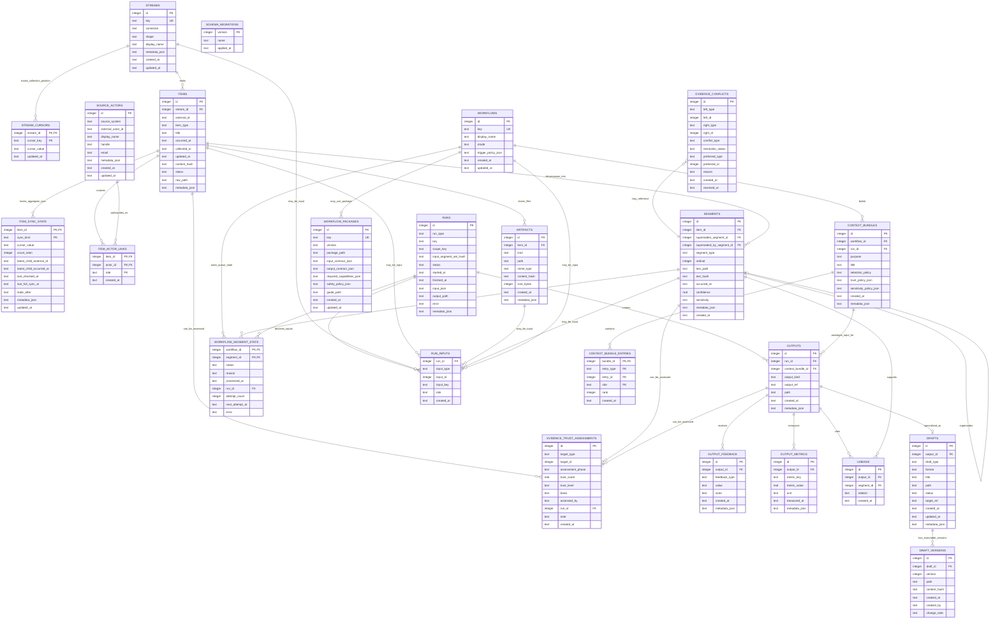

# ERD

> Part of the Continuum planning docs. See [planning index](README.md).

## 16. ERD

```mermaid
erDiagram
    STREAMS ||--o{ STREAM_CURSORS : tracks_collection_position
    STREAMS ||--o{ ITEMS : emits
    ITEMS ||--o{ ITEM_SYNC_STATE : tracks_aggregate_sync
    ITEMS ||--o{ ITEM_ACTOR_LINKS : involves
    SOURCE_ACTORS ||--o{ ITEM_ACTOR_LINKS : participates_as
    ITEMS ||--o{ EVIDENCE_TRUST_ASSESSMENTS : can_be_assessed
    SEGMENTS ||--o{ EVIDENCE_TRUST_ASSESSMENTS : can_be_assessed
    OUTPUTS ||--o{ EVIDENCE_TRUST_ASSESSMENTS : can_be_assessed
    EVIDENCE_CONFLICTS }o--|| SEGMENTS : may_reference
    ITEMS ||--o{ ARTIFACTS : stores_files
    ITEMS ||--o{ SEGMENTS : decomposes_into
    SEGMENTS ||--o| SEGMENTS : supersedes

    WORKFLOWS ||--o{ WORKFLOW_SEGMENT_STATE : owns_queue_state
    SEGMENTS ||--o{ WORKFLOW_SEGMENT_STATE : queued_for
    RUNS ||--o{ WORKFLOW_SEGMENT_STATE : last_updated_by

    RUNS ||--o{ RUN_INPUTS : declares_inputs
    WORKFLOWS ||--o{ WORKFLOW_PACKAGES : may_use_package
    WORKFLOWS ||--o{ CONTEXT_BUNDLES : builds
    CONTEXT_BUNDLES ||--o{ CONTEXT_BUNDLE_ENTRIES : contains
    STREAMS ||--o{ RUN_INPUTS : may_be_input
    ITEMS ||--o{ RUN_INPUTS : may_be_input
    ARTIFACTS ||--o{ RUN_INPUTS : may_be_input
    SEGMENTS ||--o{ RUN_INPUTS : may_be_input
    WORKFLOWS ||--o{ RUN_INPUTS : may_be_input

    RUNS ||--o{ OUTPUTS : creates
    CONTEXT_BUNDLES ||--o{ OUTPUTS : packages_input_for
    OUTPUTS ||--o{ OUTPUT_FEEDBACK : receives
    OUTPUTS ||--o{ OUTPUT_METRICS : measures
    OUTPUTS ||--o{ LINEAGE : cites
    SEGMENTS ||--o{ LINEAGE : supports

    OUTPUTS ||--o| DRAFTS : specialized_as
    DRAFTS ||--o{ DRAFT_VERSIONS : has_immutable_versions

    SCHEMA_MIGRATIONS {
      integer version PK
      text name
      text applied_at
    }

    STREAMS {
      integer id PK
      text key UK
      text connector
      text shape
      text display_name
      text metadata_json
      text created_at
      text updated_at
    }

    STREAM_CURSORS {
      integer stream_id PK,FK
      text cursor_key PK
      text cursor_value
      text updated_at
    }

    ITEMS {
      integer id PK
      integer stream_id FK
      text external_id
      text item_type
      text title
      text occurred_at
      text collected_at
      text updated_at
      text content_hash
      text status
      text raw_path
      text metadata_json
    }

    ITEM_SYNC_STATE {
      integer item_id PK,FK
      text sync_kind PK
      text cursor_value
      integer count_seen
      text latest_child_external_id
      text latest_child_occurred_at
      text last_checked_at
      text last_full_sync_at
      text stale_after
      text metadata_json
      text updated_at
    }

    SOURCE_ACTORS {
      integer id PK
      text source_system
      text external_actor_id
      text display_name
      text handle
      text email
      text metadata_json
      text created_at
      text updated_at
    }

    ITEM_ACTOR_LINKS {
      integer item_id PK,FK
      integer actor_id PK,FK
      text role PK
      text created_at
    }

    EVIDENCE_TRUST_ASSESSMENTS {
      integer id PK
      text target_type
      integer target_id
      text assessment_phase
      real trust_score
      text trust_level
      text basis
      text assessed_by
      integer run_id FK
      text note
      text created_at
    }

    EVIDENCE_CONFLICTS {
      integer id PK
      text left_type
      integer left_id
      text right_type
      integer right_id
      text conflict_type
      text resolution_status
      text preferred_type
      integer preferred_id
      text reason
      text created_at
      text resolved_at
    }

    ARTIFACTS {
      integer id PK
      integer item_id FK
      text kind
      text path
      text mime_type
      text content_hash
      integer size_bytes
      text created_at
      text metadata_json
    }

    SEGMENTS {
      integer id PK
      integer item_id FK
      integer supersedes_segment_id FK
      integer superseded_by_segment_id FK
      text segment_type
      integer ordinal
      text text_path
      text text_hash
      text occurred_at
      real confidence
      text sensitivity
      text metadata_json
      text created_at
    }

    WORKFLOWS {
      integer id PK
      text key UK
      text display_name
      text mode
      text trigger_policy_json
      text created_at
      text updated_at
    }

    WORKFLOW_PACKAGES {
      integer id PK
      text key UK
      text version
      text package_path
      text input_contract_json
      text output_contract_json
      text required_capabilities_json
      text safety_policy_json
      text guide_path
      text created_at
      text updated_at
    }

    WORKFLOW_SEGMENT_STATE {
      integer workflow_id PK,FK
      integer segment_id PK,FK
      text status
      text reason
      text processed_at
      integer run_id FK
      integer attempt_count
      text next_attempt_at
      text error
    }

    RUNS {
      integer id PK
      text run_type
      text key
      text scope_key
      text input_segment_set_hash
      text status
      text started_at
      text finished_at
      text input_json
      text output_path
      text error
      text metadata_json
    }

    RUN_INPUTS {
      integer run_id FK
      text input_type
      integer input_id
      text input_key
      text role
      text created_at
    }

    CONTEXT_BUNDLES {
      integer id PK
      integer workflow_id FK
      integer run_id FK
      text purpose
      text title
      text selection_policy
      text trust_policy_json
      text sensitivity_policy_json
      text created_at
      text metadata_json
    }

    CONTEXT_BUNDLE_ENTRIES {
      integer bundle_id PK,FK
      text entry_type PK
      integer entry_id PK
      text role PK
      integer rank
      text created_at
    }

    OUTPUTS {
      integer id PK
      integer run_id FK
      integer context_bundle_id FK
      text output_kind
      text output_ref
      text path
      text created_at
      text metadata_json
    }

    OUTPUT_FEEDBACK {
      integer id PK
      integer output_id FK
      text feedback_type
      text value
      text actor
      text created_at
      text metadata_json
    }

    OUTPUT_METRICS {
      integer id PK
      integer output_id FK
      text metric_key
      real metric_value
      text unit
      text measured_at
      text metadata_json
    }

    LINEAGE {
      integer id PK
      integer output_id FK
      integer segment_id FK
      text relation
      text created_at
    }

    DRAFTS {
      integer id PK
      integer output_id FK
      text draft_type
      text format
      text title
      text path
      text status
      text target_ref
      text created_at
      text updated_at
      text metadata_json
    }

    DRAFT_VERSIONS {
      integer id PK
      integer draft_id FK
      integer version
      text path
      text content_hash
      text created_at
      text created_by
      text change_note
    }
```
---
